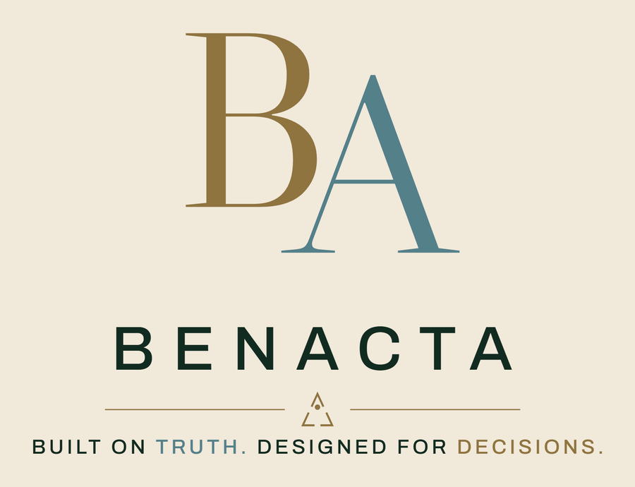
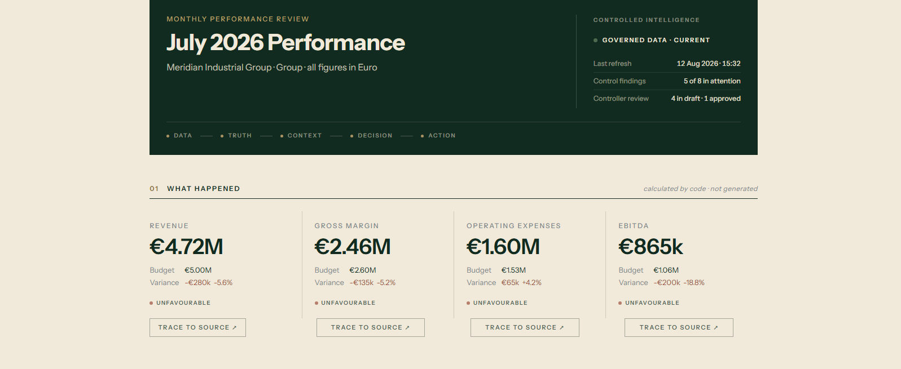
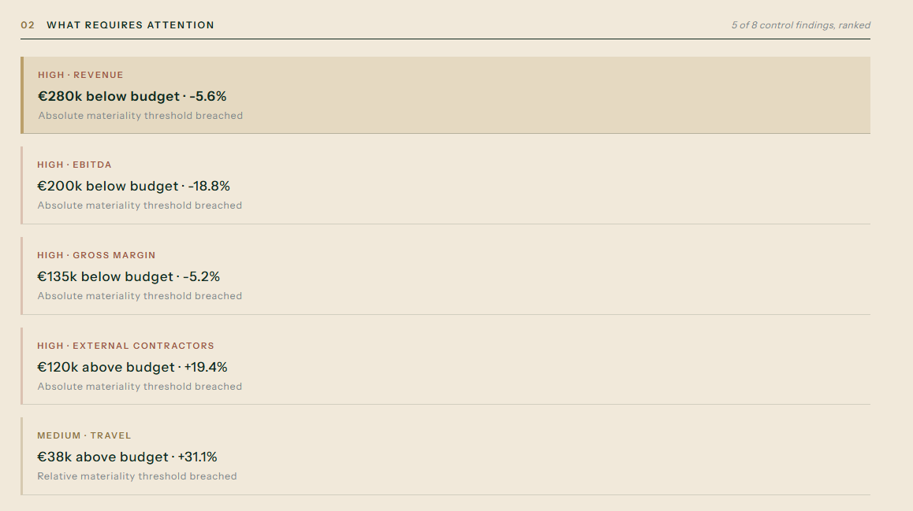
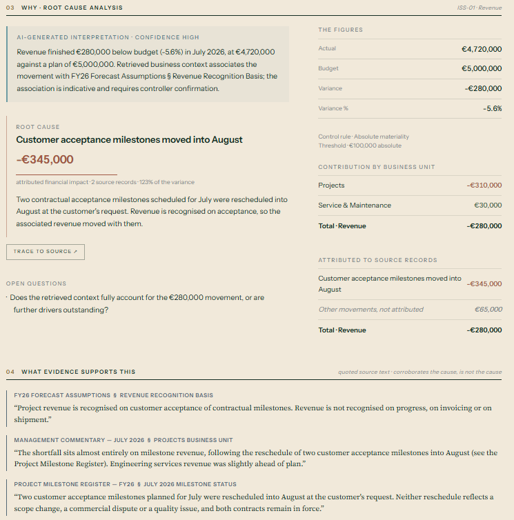
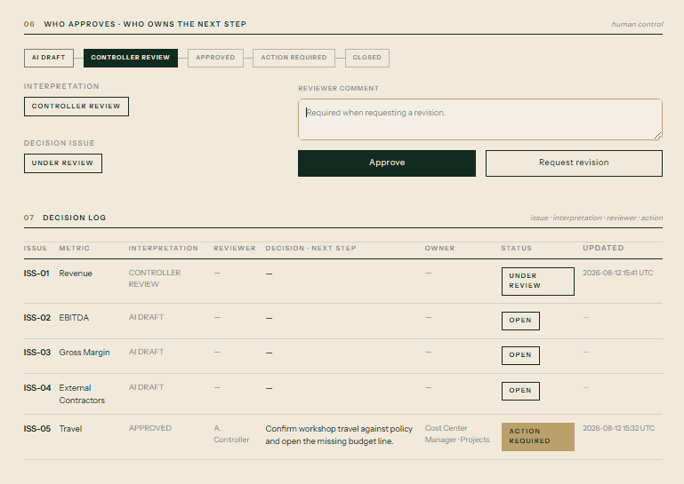
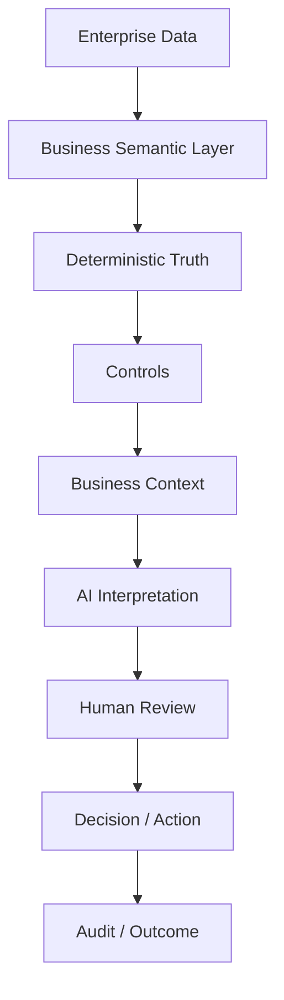
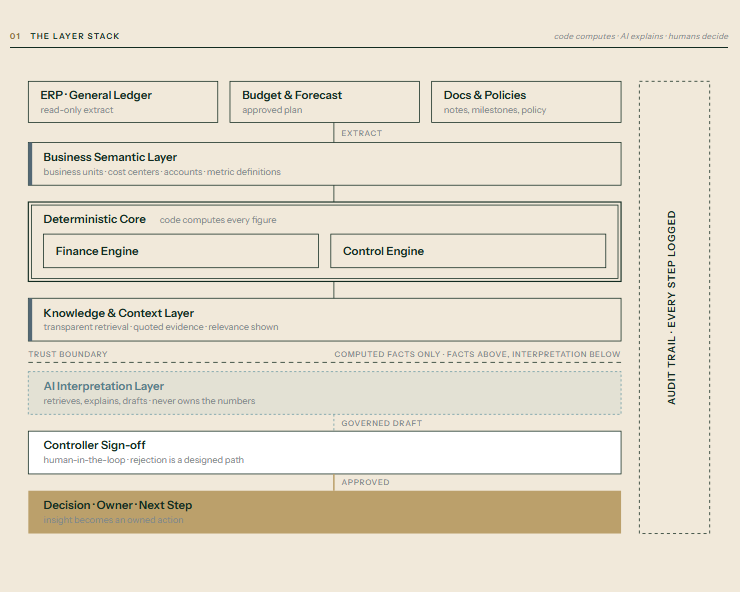

<picture>
  <source media="(prefers-color-scheme: dark)" srcset="assets/generated/benacta-primary-dark.png">
  
</picture>

# Decision Intelligence Reference Architecture

**An LLM should never own your numbers. It should explain them.**

**CODE COMPUTES. AI EXPLAINS. HUMANS DECIDE.**

A working reference implementation showing how governed enterprise data moves through business meaning, deterministic truth, contextual interpretation, human judgment and action. The first vertical slice is Finance, a Monthly Performance Review; BENACTA is broader than Finance.

**[▶ Open the live Decision Cockpit](https://benacta-di.streamlit.app/)** · no sign-up, no API key.

`DEMO_MODE=true` · 155/155 tests passing · no API key required · Python + Streamlit + Pandas

---

> **V2 in progress: BENACTA Margin Control.** Next to this V1 blueprint, `apps/api` builds a Finance decision system on
> Odoo 19 that detects, investigates, decides and acts on gross-margin leakage at transaction level. Milestones 1 and 2
> (governed data, reconciled margin, deterministic exception engine with evidence, decisions, controlled action, impact,
> audit, investigation on governed documents, a six-screen cockpit) run locally without any credential:
> `docs/margin_control_demo.md`. Audit and roadmap: `docs/repository_audit.md`, `docs/product_backlog.md`.

## The problem

Most enterprise AI demonstrations begin with the model. Enterprise decision-making cannot.

Financial and operational truth has to stay reproducible, controlled, traceable and auditable: a controller has to be able to answer, for any number a system shows, *where did that come from and who signed off on it?* AI can sit around that truth: retrieving context, interpreting change, drafting explanations, surfacing questions. It cannot sit inside it.

The objective here is not *"chat with your ERP."* It is:

> **Turn governed enterprise truth into better decisions and action.**

## What this reference implementation demonstrates

1. Finance data enters a governed, deterministic layer; nothing downstream may recompute it.
2. Business objects give raw ledger rows their meaning before anything is calculated.
3. Code calculates every figure: actual, budget, variance, variance %.
4. Transparent control rules surface which movements are material.
5. Relevant business context is retrieved, with the exact reason it was selected.
6. AI drafts an interpretation from the computed facts and the retrieved evidence, never the other way round.
7. A named human reviews it. Nothing is published without controller sign-off.
8. The reviewed issue becomes an owned next step; insight without action is incomplete.
9. Every step is logged, so any statement on screen can be traced back to its source.

## Decision Cockpit

[](https://benacta-di.streamlit.app/)

*The executive entry point. Every figure on this screen was calculated by code from the committed ledger; the header says so (`calculated by code · not generated`), and the `TRACE TO SOURCE` control on each metric opens the reconciliation behind the figure.*

## From signal to decision

The cockpit follows the order a monthly review actually runs in: what happened, what requires attention, why, and who decides. The same Revenue issue is followed through all three screens below.

### Attention: what the controls surfaced



*Eight control findings, five above the materiality thresholds, ranked. Each row names the rule that fired, absolute or relative materiality, so the attention list is the output of a published policy rather than an editorial choice.*

### Evidence and interpretation: why it happened



*The computed figures sit on the right. The interpretation sits on the left, labelled `AI-GENERATED INTERPRETATION`, drafted from those figures and the evidence below, and explicit that the association it draws "is indicative and requires controller confirmation." Each evidence block quotes the source document verbatim, with its section reference.*

### Human review and action: who decides



*Nothing publishes itself. The interpretation moves `AI DRAFT → CONTROLLER REVIEW → APPROVED`, a named reviewer either approves it or sends it back with a comment, and the decision log carries each issue to an owner, a next step and a status.*

## Reference scenario

### Why is Revenue below budget?

**Truth, calculated by code from `data/actuals.csv` and `data/budget.csv`:**

| | Revenue · July 2026 |
|---|---:|
| Actual | €4,720,000 |
| Budget | €5,000,000 |
| Variance | −€280,000 |
| Variance % | −5.6% |

**What happened?** Revenue finished €280,000 below budget for the month.

**Why?** Two customer acceptance milestones planned for July were rescheduled into August at the customer's request: no scope change, no commercial dispute, both contracts remain in force.

**What requires attention?** HIGH: the variance exceeds the company's €100,000 absolute materiality threshold, published in `data/context/finance_policy.md`, so the threshold itself is citable.

**Evidence retrieved**, each with the system's own reason for selecting it:

- ✓ *FY26 Forecast Assumptions* § Revenue Recognition Basis
- ✓ *Management Commentary July 2026* § Projects Business Unit
- ✓ *Project Milestone Register FY26* § July 2026 Milestone Status

**AI-generated interpretation · Controller approval required.** *"Revenue finished €280,000 below budget (−5.6%) in July 2026 ... Retrieved business context associates the movement with FY26 Forecast Assumptions § Revenue Recognition Basis; the association is indicative and requires controller confirmation."*

**Suggested follow-up:** Review milestone recognition with Project Finance. *(A proposal for a human, never labeled a decision.)* Owner suggestion: Project Finance.

**Human control:** the interpretation sits in `AI DRAFT` until a controller either approves it or sends it back with a comment; both paths are exercised in the running app, and both are logged.

## From data to decision



Each arrow is a transition the running system actually performs: business meaning is applied before any figure is computed, controls evaluate computed facts rather than raw rows, interpretation is drafted only after evidence is retrieved, and nothing reaches Decision/Action without a named reviewer.

## From tables to business objects

Enterprise systems store rows. A monthly review reasons about projects, customers, cost centers, accounts and milestones, and about the relationships between them: which project serves which customer, which cost center carries the spend, which milestone releases the revenue.

The **Business Semantic Layer** (`src/domain.py`) maps every ledger row onto a governed model, `BusinessUnit → CostCenter → Account`, with metric definitions composed over account categories. Each metric declares a direction (`higher_is_better`), so the engine reads favourability the way a controller would: Operating Expenses above budget is unfavourable, Revenue above budget is favourable, and the raw sign of the variance decides neither. A row that references an unknown account, or disagrees with the governed chart of accounts, is **rejected** at load instead of disappearing into a total nobody can reconcile.

*A note for technical readers:* this pattern (business objects and relationships before rules, context and decisions) shares conceptual DNA with ontology-driven enterprise platforms such as Palantir Foundry/AIP. The inspiration stops at the pattern. There is no Foundry code, branding, UI imitation or implied affiliation here, and V1 does not attempt a general-purpose ontology engine; it is a lightweight domain model sized for one use case.

## Code computes. AI explains. Humans decide.



*The Architecture view, rendered by the running application. The dashed line across the middle is the trust boundary: **computed facts only; facts above, interpretation below.** The deterministic core is boxed and closed, the AI layer beneath it retrieves, explains and drafts without ever owning a number, and the audit spine runs the full height of the stack.*

The trust boundary is the architecture's central claim, and the repository carries a test that fails if it is crossed.

| Layer | Owns | Never |
|---|---|---|
| **Deterministic Core** | Figures, calculations, metrics, controls, business rules and context retrieval, which selects and quotes existing text with a transparent score | Never reasons in natural language |
| **Knowledge / AI Layer** | Interpretation, drafting, open questions | Never computes, recomputes or alters a figure |
| **Human Layer** | Judgment, approval, accountability, action | Nothing publishes without it |

Retrieval sits on the deterministic side of the boundary because it generates nothing: the evidence a reader sees is quoted source text with a visible relevance score, never model output. `tests/test_ai_independence.py` treats `src/retrieval.py` as part of the truth layer and holds it to the same no-AI-imports rule.

**The LLM is not the system of record.** It receives computed facts, control alerts and retrieved evidence, never the ledger, and returns a draft a human must approve. Disabling the AI layer entirely changes nothing about the figures, the controls or the materiality: `tests/test_ai_independence.py::test_financial_truth_is_independent_from_llm` proves it, structurally (no import path from the deterministic modules to any LLM SDK) and behaviorally (the full truth pipeline re-run with those imports actively blocked, producing byte-identical facts and alerts).

### What the LLM is allowed to do

- Retrieve context and cite where it came from
- Summarize evidence, quoting rather than paraphrasing the source
- Interpret deterministic findings it was handed
- Assist human judgment, including by naming what it cannot account for
- Formulate explanations in business language

### What the LLM is not allowed to do

- Calculate financial truth
- Silently modify a governed metric
- Become the system of record
- Approve a decision autonomously
- Execute a material action outside the configured control path

The last two hold structurally rather than by prompt: approval is a state machine (`src/approval.py`) that raises on illegal transitions, and the AI layer holds no reference to it.

## What the reference implementation contains

Everything below is verified against the current codebase:

- A fictional enterprise finance dataset (Meridian Industrial Group, EUR, one coherent July 2026 story)
- Business Semantic Layer (`src/domain.py`)
- Deterministic Finance Engine (`src/finance_engine.py`): `variance = actual − budget`, `variance_pct = variance / abs(budget)`
- Transparent Control Engine (`src/control_engine.py`): absolute/relative materiality, missing-budget governance gaps
- Management context documents and transparent keyword retrieval (`src/retrieval.py`); no vector database
- Source-to-transaction lineage and reconciliation (`src/lineage.py`): Revenue is elaborated down to individual postings that reconcile to the figure exactly; every finding traces to the source records behind it. Composed metrics (Gross Margin, Operating Expenses, EBITDA) stop at source-record grain in this dataset, and the cockpit says so instead of presenting a partial ledger as complete
- Demo Mode interpretation, and an optional real LLM provider behind one interface (`src/commentary.py`)
- Controller review: a strict state machine where illegal transitions raise (`src/approval.py`)
- Decision / Action workflow: owner, next step, status (`src/decision_log.py`)
- Append-only Audit Trail, exportable as JSON (`src/audit.py`)
- Executive Decision Cockpit, Architecture view and Audit Trail view (`app.py`, `src/theme.py`)
- 155 tests, including the AI-independence proof

## Technical architecture


`src/commentary.py` is the only module permitted to talk to a language model, and the only one below the trust boundary. `src/lineage.py` (source-record and transaction reconciliation), `src/pipeline.py` (wires the loop above into one session so the CLI demo and the cockpit never drift apart) and `src/theme.py` (the charter's visual system) sit alongside this chain without crossing it.

## Why AI independence matters

Remove the AI layer and the numbers do not move: the same actuals, budget, variances and variance percentages come out of the deterministic pipeline, and the same control rules fire at the same severities with the same materiality classification. None of it was ever the LLM's to compute.

```
tests/test_ai_independence.py::test_financial_truth_is_independent_from_llm
```

That independence is also operational: the commentary provider can be swapped, rate-limited or switched off in production without touching the figures, because interpretation is the only thing it ever produced.

## Live demo

**https://benacta-di.streamlit.app**

The full loop, running: the cockpit, the ranked attention list, the evidence and interpretation blocks, controller approval, the decision log and the audit trail. No sign-up, no API key, nothing to install. It runs in Demo Mode on the same fictional dataset committed to this repository, so the figures you see are the ones the tests assert.

The app sleeps when idle and takes a few seconds to wake on the first request.

## Quick start

```bash
git clone https://github.com/anasbenazzouz/benacta-decision-intelligence-blueprint.git
cd benacta-decision-intelligence-blueprint

python -m venv .venv
source .venv/bin/activate        # Windows: .venv\Scripts\activate

pip install -r requirements.txt

pytest -q                        # 155 passed
python scripts/demo_decision_loop.py   # CLI walk through TRUTH → CONTEXT → INTERPRETATION → REVIEW → ACTION → AUDIT

streamlit run app.py             # the Executive Decision Cockpit · opens at localhost:8501
```

No API key, no configuration file and no environment variable is required for any of the above. Demo Mode is the built-in default (`DEMO_MODE` is only read if you set it) and the supported public configuration: the deterministic layer, retrieval, review workflow and audit trail all run exactly as described, with commentary produced from controlled, evidence-based templates. `.env.example` documents the two variables that exist; nothing loads it for you.

To enable real LLM commentary instead, install the optional dependency, set `DEMO_MODE=false` in your environment and provide a key:

```bash
pip install anthropic
# .env: DEMO_MODE=false
#       ANTHROPIC_API_KEY=...
```

If the key or the package is missing, the app falls back to Demo Mode visibly: never a crash, never a silent gap.

## Project structure

```text
benacta-decision-intelligence-blueprint/
├── app.py                     Executive Decision Cockpit · Architecture · Audit Trail
├── requirements.txt / .env.example
│
├── data/
│   ├── actuals.csv · budget.csv · budget_lines.csv · transactions.csv · source_records.csv
│   └── context/                management notes, milestones, forecast assumptions, travel & finance policy
│
├── src/
│   ├── domain.py                business semantic layer
│   ├── finance_engine.py        deterministic truth, the value core
│   ├── control_engine.py        transparent materiality rules
│   ├── retrieval.py             transparent evidence retrieval
│   ├── lineage.py                source-to-transaction reconciliation
│   ├── commentary.py            the trust boundary: demo + optional LLM interpretation
│   ├── approval.py              human-in-the-loop state machine
│   ├── decision_log.py          issue → owner → next step → status
│   ├── audit.py                 lineage: every step logged
│   ├── pipeline.py              assembles the loop into one session
│   └── theme.py                 charter tokens + Streamlit CSS
│
├── assets/
│   ├── fonts/                   charter type families, vendored for offline PDF rendering
│   └── generated/               logo lockups · cockpit screenshots
│
├── scripts/
│   ├── demo_decision_loop.py    CLI walkthrough of the full loop
│   ├── render_blueprint.py      Blueprint HTML → PDF + page images for visual QA
│   └── vendor_fonts.py · prepare_brand_assets.py
│
├── tests/                       155 tests across 8 files
└── docs/                        architecture · implementation guide · demo script · Blueprint (HTML + PDF)
```

## Tests

```
python -m pytest -q
```

155 tests across 8 files: variance/percentage correctness and boundary cases, control-rule thresholds and severities, retrieval determinism and evidence fields, source-to-transaction reconciliation, approval and decision-lifecycle transitions (legal and illegal), audit-record completeness, and AI independence, both structural (no import path from the deterministic modules to any LLM SDK) and behavioral (the full truth pipeline re-run with those imports blocked). All 155 pass with no API key present in the environment.

## Documentation

| | |
|---|---|
| [**Executive Blueprint** (PDF)](docs/BENACTA_Controlled_Intelligence_Blueprint.pdf) | *Controlled Intelligence*, the ten-page architecture note behind this implementation, written for executives and architects. Start here if you want the thinking rather than the code. |
| [Architecture](docs/architecture.md) | Layers, data contracts, module responsibilities, the trust boundary as an enforced rule |
| [Implementation guide](docs/implementation-guide.md) | Run it, extend it, adapt it: adding a metric, a control rule, a context document, a commentary provider |
| [Demo script](docs/demo-script.md) | Three walkthroughs of the same running app: 30 seconds, 5 minutes, 15 minutes |

The Blueprint's print master is committed as HTML (`docs/controlled-intelligence-blueprint.html`) and regenerated with `python scripts/render_blueprint.py`, so the PDF is reproducible rather than a binary drop.

## Scope and limitations

This repository proves the architecture end to end on one decision process, the monthly performance review. It is a working reference, small enough to read in full, and it draws hard boundaries:

- One vertical slice: one use case, one fictional company (Meridian Industrial Group), one period.
- Fictional data throughout. The CSV extracts stand in for read-only feeds from an ERP and a planning system; there is no live integration.
- Retrieval is transparent keyword scoring over a small governed document set. A production build would put a search or RAG stack behind the same provider interface and keep the citation contract.
- The review and decision workflows are two state machines in code. Routing, delegation and deadlines belong to an enterprise workflow system.
- Read-only by design: nothing writes back to a source system. In production, an approved action would raise a task or posting in the application that owns it, under that application's controls.
- Posting-grain lineage exists for Revenue only; the composed metrics resolve to their source records and stop there, and the cockpit says so.

It does not replace an ERP, an EPM, a BI platform or a general-purpose ontology engine, and it is not an autonomous CFO. V1 exists to make the trust boundary concrete and testable with the smallest implementation that can carry it.

## From reference implementation to enterprise

The broader BENACTA direction, not V1 functionality:

| | |
|---|---|
| **Connect** | ERP · EPM · CRM · data platforms · documents · APIs |
| **Model** | Business objects · relationships · metrics · rules |
| **Understand** | Events · exceptions · variances · drivers · scenarios |
| **Augment** | Retrieval · AI interpretation · decision support |
| **Act** | Approvals · tasks · workflows · operational actions |
| **Govern** | Lineage · auditability · permissions · human accountability |
| **Learn** | Decision history · outcomes · feedback |

> Start with high-value decision workflows. Prove value. Build reusable components. Expand the decision graph over time.

---

<picture>
  <source media="(prefers-color-scheme: dark)" srcset="assets/generated/benacta-primary-dark.png">
  
</picture>

## About BENACTA

**BENACTA** · Enterprise AI · Decision Intelligence

### Turning enterprise data into decisions and action.

BENACTA designs AI-native decision systems that connect enterprise data, governed business logic, contextual AI and human judgment across Finance, Operations, Performance and Workflows.

This repository is the first public reference implementation of that architecture. Finance comes first because the monthly performance review already runs on governed figures, materiality thresholds and controller sign-off; the same chain of plan versus actual, threshold, evidence, owner and action carries into supply chain and operations decisions.

**Built on Truth. Designed for Decisions.**

Anas Benazzouz · BENACTA · AI Engineering · Finance & Operations

---

*Published as a public reference implementation. No open-source license has been selected yet; that decision is deferred, and all rights are reserved in the meantime. All business data in this repository is fictional.*
