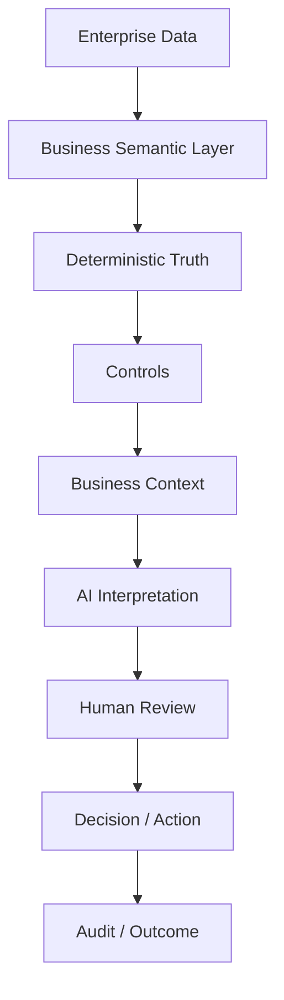
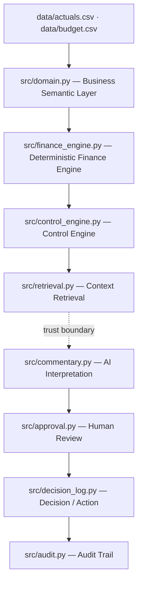

<picture>
  <source media="(prefers-color-scheme: dark)" srcset="assets/generated/benacta-primary-dark.png">
  
</picture>

# Decision Intelligence Reference Architecture

**An LLM should never own your numbers. It should explain them.**

**CODE COMPUTES. AI EXPLAINS. HUMANS DECIDE.**

A working reference implementation showing how governed enterprise data moves through business meaning, deterministic truth, contextual interpretation, human judgment and action. Finance — a Monthly Performance Review — is the first vertical slice; BENACTA is broader than Finance.

`DEMO_MODE=true` · 155/155 tests passing · no API key required · Python + Streamlit + Pandas

---

## The problem

Most enterprise AI demonstrations begin with the model. Enterprise decision-making cannot.

Financial and operational truth has to stay reproducible, controlled, traceable and auditable — a controller has to be able to answer, for any number a system shows, *where did that come from and who signed off on it?* AI can sit around that truth: retrieving context, interpreting change, drafting explanations, surfacing questions. It cannot sit inside it.

The objective here is not *"chat with your ERP."* It is:

> **Turn governed enterprise truth into better decisions and action.**

## What this reference implementation demonstrates

1. Finance data enters a governed, deterministic layer — nothing downstream may recompute it.
2. Business objects give raw ledger rows their meaning before anything is calculated.
3. Code calculates every figure: actual, budget, variance, variance %.
4. Transparent control rules surface which movements are material.
5. Relevant business context is retrieved — with the exact reason it was selected.
6. AI drafts an interpretation from the computed facts and the retrieved evidence, never the other way round.
7. A named human reviews it. Nothing is published without controller sign-off.
8. The reviewed issue becomes an owned next step — insight without action is incomplete.
9. Every step is logged, so any statement on screen can be traced back to its source.

## One concrete example

### Why is Revenue below budget?

**Truth — calculated by code, from `data/actuals.csv` and `data/budget.csv`:**

| | Revenue · July 2026 |
|---|---:|
| Actual | €4,720,000 |
| Budget | €5,000,000 |
| Variance | −€280,000 |
| Variance % | −5.6% |

**What happened?** Revenue finished €280,000 below budget for the month.

**Why?** Two customer acceptance milestones planned for July were rescheduled into August at the customer's request — no scope change, no commercial dispute, both contracts remain in force.

**What requires attention?** HIGH — the variance exceeds the company's €100,000 absolute materiality threshold (published in `data/context/finance_policy.md`, so the threshold itself is citable, not just asserted).

**Evidence retrieved** — the system's own reasons for selecting these sources, not a curated list:

- ✓ *FY26 Forecast Assumptions* § Revenue Recognition Basis
- ✓ *Management Commentary — July 2026* § Projects Business Unit
- ✓ *Project Milestone Register — FY26* § July 2026 Milestone Status

**AI-generated interpretation · Controller approval required.** *"Revenue finished €280,000 below budget (−5.6%) in July 2026 ... Retrieved business context associates the movement with FY26 Forecast Assumptions § Revenue Recognition Basis; the association is indicative and requires controller confirmation."*

**Suggested follow-up:** Review milestone recognition with Project Finance. *(A proposal for a human — never labeled a decision.)* Owner suggestion: Project Finance.

**Human control:** the interpretation sits in `AI DRAFT` until a controller either approves it or sends it back with a comment — both paths are exercised in the running app, and both are logged.

## From data to decision



Each arrow is a real transition in the running system, not a slide: business meaning is applied before a single figure is computed; controls run on computed facts, never on raw rows; interpretation is drafted only after evidence is retrieved; nothing moves to Decision/Action without a named reviewer.

## From tables to business objects

Enterprise systems store rows. Businesses make decisions about projects, customers, cost centers, accounts and milestones — objects with relationships, not isolated cells in a spreadsheet.

This reference implementation's **Business Semantic Layer** (`src/domain.py`) maps every ledger row onto a governed model — `BusinessUnit → CostCenter → Account`, with metric definitions composed over account categories and a declared direction (`higher_is_better`), so favourability is business meaning, not the sign of a number. A row that references an unknown account, or that disagrees with the governed chart of accounts, is **rejected**, not silently aggregated — that rejection is the proof that raw data and business meaning are different things.

*A note for technical readers:* this pattern — business objects and relationships before rules, context and decisions — shares conceptual DNA with ontology-driven enterprise platforms such as Palantir Foundry/AIP. The inspiration stops at the pattern. There is no Foundry code, branding, UI imitation or implied affiliation here, and V1 does not attempt a general-purpose ontology engine — it is a lightweight domain model sized for one use case.

## Code computes. AI explains. Humans decide.

The trust boundary is the architecture's central claim, and it is enforced, not just asserted.

| Layer | Owns | Never |
|---|---|---|
| **Deterministic Core** | Figures, calculations, metrics, controls, business rules — and context retrieval, which selects and quotes existing text with a transparent score | Never reasons in natural language |
| **Knowledge / AI Layer** | Interpretation, drafting, open questions | Never computes, recomputes or alters a figure |
| **Human Layer** | Judgment, approval, accountability, action | Nothing publishes without it |

Retrieval sits on the deterministic side deliberately: it generates nothing, so the evidence a reader sees is quoted source text rather than something the model produced. `tests/test_ai_independence.py` treats `src/retrieval.py` as part of the truth layer and holds it to the same no-AI-imports rule.

**The LLM is not the system of record.** It receives computed facts, control alerts and retrieved evidence — never the ledger — and returns a draft a human must approve. Disabling the AI layer entirely changes nothing about the figures, the controls or the materiality: `tests/test_ai_independence.py::test_financial_truth_is_independent_from_llm` proves it, structurally (no import path from the deterministic modules to any LLM SDK) and behaviorally (the full truth pipeline re-run with those imports actively blocked, producing byte-identical facts and alerts).

## What the reference implementation contains

Verified against the current codebase — nothing here is aspirational:

- A fictional enterprise finance dataset (Meridian Industrial Group, EUR, one coherent July 2026 story)
- Business Semantic Layer (`src/domain.py`)
- Deterministic Finance Engine (`src/finance_engine.py`) — `variance = actual − budget`, `variance_pct = variance / abs(budget)`
- Transparent Control Engine (`src/control_engine.py`) — absolute/relative materiality, missing-budget governance gaps
- Management context documents and transparent keyword retrieval (`src/retrieval.py`) — no vector database
- Source-to-transaction lineage and reconciliation (`src/lineage.py`) — Revenue is elaborated down to individual postings that reconcile to the figure exactly; every finding traces to the source records behind it. Composed metrics (Gross Margin, Operating Expenses, EBITDA) are deliberately *not* carried to posting grain in this dataset, and the cockpit says so rather than showing a partial ledger as if it were complete
- Demo Mode interpretation, and an optional real LLM provider behind one interface (`src/commentary.py`)
- Controller review — a strict state machine, illegal transitions raise (`src/approval.py`)
- Decision / Action workflow — owner, next step, status (`src/decision_log.py`)
- Append-only Audit Trail, exportable as JSON (`src/audit.py`)
- Executive Decision Cockpit, Architecture view and Audit Trail view (`app.py`, `src/theme.py`)
- 155 tests, including the AI-independence proof

## See it

Screenshots are deferred to the release / visual QA phase (capture plan:
`assets/generated/screenshots/README.md` — five shots, Executive Cockpit →
Attention/Decision Detail → Evidence + Interpretation → Human Review +
Action → Architecture View). Until then, run it yourself in about a minute:

```bash
DEMO_MODE=true streamlit run app.py
```

## Technical architecture



`src/commentary.py` is the only module permitted to talk to a language model, and the only one below the trust boundary. `src/lineage.py` (source-record and transaction reconciliation), `src/pipeline.py` (wires the loop above into one session so the CLI demo and the cockpit never drift apart) and `src/theme.py` (the charter's visual system) sit alongside this chain without crossing it.

## Why AI independence matters

If the AI layer disappeared tomorrow, Actual would still be correct. Budget would still be correct. Variance and variance % would still be correct. Controls would still run, and materiality would still be classified the same way — because none of it was ever the AI's to compute.

```
tests/test_ai_independence.py::test_financial_truth_is_independent_from_llm
```

This is the philosophically load-bearing test in the repository. AI augments interpretation. It does not own the truth.

## Quick start

```bash
git clone https://github.com/anasbenazzouz/benacta-decision-intelligence-blueprint.git
cd benacta-decision-intelligence-blueprint

python -m venv .venv
source .venv/bin/activate        # Windows: .venv\Scripts\activate

pip install -r requirements.txt
cp .env.example .env             # DEMO_MODE=true by default — Windows: copy .env.example .env

pytest -q                        # 155 passed
python scripts/demo_decision_loop.py   # CLI walk through TRUTH → CONTEXT → INTERPRETATION → REVIEW → ACTION → AUDIT

streamlit run app.py             # the Executive Decision Cockpit — opens at localhost:8501
```

No API key is required for any of the above. `DEMO_MODE=true` is the default and the supported public configuration — the deterministic layer, retrieval, review workflow and audit trail all run exactly as described with commentary produced from controlled, evidence-based templates.

To enable real LLM commentary instead, install the optional dependency, set `DEMO_MODE=false` and provide a key:

```bash
pip install anthropic
# .env: DEMO_MODE=false
#       ANTHROPIC_API_KEY=...
```

If the key or the package is missing, the app falls back to Demo Mode visibly — never a crash, never a silent gap.

## Project structure

```text
benacta-decision-intelligence-blueprint/
├── app.py                     Executive Decision Cockpit · Architecture · Audit Trail
├── requirements.txt / .env.example
│
├── data/
│   ├── actuals.csv · budget.csv · budget_lines.csv · transactions.csv · source_records.csv
│   └── context/                management notes, milestones, forecast assumptions, travel & finance policy
│
├── src/
│   ├── domain.py                business semantic layer
│   ├── finance_engine.py        deterministic truth — the value core
│   ├── control_engine.py        transparent materiality rules
│   ├── retrieval.py             transparent evidence retrieval
│   ├── lineage.py                source-to-transaction reconciliation
│   ├── commentary.py            — trust boundary — demo + optional LLM interpretation
│   ├── approval.py              human-in-the-loop state machine
│   ├── decision_log.py          issue → owner → next step → status
│   ├── audit.py                 lineage: every step logged
│   ├── pipeline.py              assembles the loop into one session
│   └── theme.py                 charter tokens + Streamlit CSS
│
├── scripts/demo_decision_loop.py  CLI walkthrough of the full loop
├── tests/                       155 tests across 8 files
└── docs/                        architecture, acceptance criteria, UI QA, demo script, implementation guide
```

## Tests

```
python -m pytest -q
```

155 tests across 8 files: variance/percentage correctness and boundary cases, control-rule thresholds and severities, retrieval determinism and evidence fields, source-to-transaction reconciliation, approval and decision-lifecycle transitions (legal and illegal), audit-record completeness, and AI independence — both structural (no import path from the deterministic modules to any LLM SDK) and behavioral (the full truth pipeline re-run with those imports blocked). All 155 pass with no API key present in the environment.

## Limitations

This is a reference implementation — a design pattern proven end-to-end, not a finished product. It is:

- a thin, complete vertical slice through one use case (Monthly Performance Review), not a platform
- fictional data end-to-end — no real client, no real integration
- retrieval by transparent keyword scoring, not a production search or RAG stack
- a demonstration workflow (two state machines), not a workflow engine
- read-only by design — nothing here writes back to any source system
- posting-grain lineage for Revenue only; the composed metrics resolve to their source records and stop there

It is deliberately **not**: a production ERP or finance application, an autonomous CFO, a full ontology platform, a Palantir replacement, or a finished BENACTA enterprise platform. The elegance of this V1 is in proving the architecture with the smallest implementation that makes the trust boundary real and testable.

## From reference implementation to enterprise

The broader BENACTA direction — not V1 functionality:

| | |
|---|---|
| **Connect** | ERP · EPM · CRM · data platforms · documents · APIs |
| **Model** | Business objects · relationships · metrics · rules |
| **Understand** | Events · exceptions · variances · drivers · scenarios |
| **Augment** | Retrieval · AI interpretation · decision support |
| **Act** | Approvals · tasks · workflows · operational actions |
| **Govern** | Lineage · auditability · permissions · human accountability |
| **Learn** | Decision history · outcomes · feedback |

> Start with high-value decision workflows. Prove value. Build reusable components. Expand the decision graph over time.

---

<picture>
  <source media="(prefers-color-scheme: dark)" srcset="assets/generated/benacta-primary-dark.png">
  
</picture>

**BENACTA** · Enterprise AI · Decision Intelligence
### AI-Native Decision Systems
Finance · Operations · Performance · Workflows

BENACTA designs and builds AI-native decision systems at the intersection of enterprise AI, decision intelligence, data, business logic, workflows and human judgment. This repository is the first reference implementation of that architecture — Finance is the wedge, not the whole of it.

**Built on Truth. Designed for Decisions.**

Anas Benazzouz — BENACTA · AI Engineering · Finance & Operations

---

*License: none selected yet — deliberately deferred, all rights reserved by default in the meantime. All data in this repository is fictional.*
